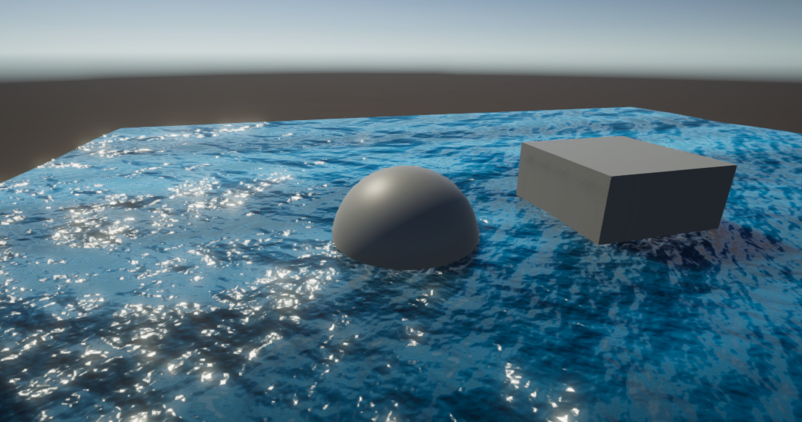

# Universal Ocean Shader Graph

# Requirements

- Unity 2019.3
  - Universal Render Pipeline 7.1.7

# Getting Started

- Open Scenes/SampleScene.unity
- Play

"Water" GameObject has a Material of the Shader Graph.

# Idea Source

OCEAN shader with Unity Shader Graph!  

https://www.youtube.com/watch?v=FbTAbOnhRcI
